# Plan: Omnichannel Convenience Store Platform (Quarkus + Next.js)

**TL;DR** — Design and deliver a cloud-native, event-driven omnichannel retail platform on AWS EKS. 10 backend microservices (Quarkus/Java 21, Hibernate Panache, Mutiny, GraalVM native), 2 web frontends (Next.js — public shop SSR, staff CRM/POS CSR), 1 cross-platform mobile app (React Native/Expo), Kafka (MSK) for async, Temporal for saga orchestration, Keycloak for auth, PostgreSQL (one DB per service), OpenTelemetry observability. **All synchronous inter-service and client-facing APIs are REST — no gRPC.**

---

## 1. Microservices (10 total)

Each service = own Postgres database, own Git module/repo, own Kafka producer/consumer set, own REST contract (OpenAPI 3). **All synchronous inter-service and client-facing APIs are REST — no gRPC.**

| # | Service | Bounded Context | Sync API | Key Events Emitted | Key Events Consumed |
|---|---------|-----------------|----------|--------------------|---------------------|
| 1 | **Identity & Auth** | Users, roles, sessions, OIDC | REST `/auth/*` | `UserRegistered`, `UserDeactivated` | — |
| 2 | **Product & Catalog** | Products, categories, SKUs, attributes, media | REST | `ProductCreated`, `ProductUpdated`, `PriceChanged` | — |
| 3 | **Inventory** | Stock per location, reservations, transfers | REST | `StockReserved`, `StockReleased`, `StockAdjusted`, `LowStockAlert` | `OrderPlaced`, `OrderCancelled`, `POSSaleCompleted` |
| 4 | **Pricing & Promotions** | Price lists, discounts, coupons, campaigns | REST | `CouponIssued`, `CouponRedeemed`, `PromotionActivated` | `LoyaltyTierChanged` |
| 5 | **Order & Checkout** | Online orders, cart, checkout state | REST | `OrderPlaced`, `OrderConfirmed`, `OrderCancelled`, `OrderCompleted` | `PaymentAuthorized`, `PaymentFailed`, `StockReserved`, `ShipmentCreated` |
| 6 | **Payment** | Payment intents, gateway integrations (Stripe + local), refunds | REST | `PaymentAuthorized`, `PaymentCaptured`, `PaymentFailed`, `RefundProcessed` | `OrderPlaced`, `OrderCancelled` |
| 7 | **Shipping & Fulfillment** | Delivery, click-and-collect, carriers | REST | `ShipmentCreated`, `ShipmentDispatched`, `ShipmentDelivered` | `OrderConfirmed`, `OrderCancelled` |
| 8 | **Store & POS** | Physical stores, registers, cashier sessions, in-store sales | REST | `POSSaleCompleted`, `POSShiftOpened`, `POSShiftClosed`, `CashDropRecorded` | `ProductUpdated`, `PriceChanged` |
| 9 | **CRM & Loyalty** | Customer profiles, tiers, points, segments | REST | `LoyaltyPointsEarned`, `LoyaltyPointsRedeemed`, `LoyaltyTierChanged`, `SegmentMembershipChanged` | `OrderCompleted`, `POSSaleCompleted`, `CouponRedeemed` |
| 10 | **Notification** | Email/SMS/push delivery, templates | REST (admin) | `NotificationDispatched`, `NotificationFailed` | `OrderConfirmed`, `OrderCompleted`, `ShipmentDispatched`, `LoyaltyTierChanged`, `LowStockAlert` |
| + | **Search** (read-model) | OpenSearch-backed product/customer search | REST | — | `ProductCreated/Updated`, `PriceChanged`, `StockAdjusted` |

**Cross-cutting components** (not domain services):
- **API Gateway**: Apache APISIX on EKS (rate limit, OIDC introspection, routing).
- **Keycloak**: separate cluster, OIDC provider.
- **Temporal Cluster**: saga orchestration (Order saga, Refund saga, Returns saga).
- **Kafka (MSK)**: 3-broker cluster, topic-per-event-type, Avro + Schema Registry.
- **Outbox relay**: Debezium CDC from each service's `outbox` table → Kafka.

---

## 2. Database Design (PostgreSQL — one DB per service)

All tables include `id BIGSERIAL`, `created_at`, `updated_at`, `version` (optimistic lock), `tenant_id` (multi-store-chain ready). Every service has an `outbox` table for transactional event publication.

### 2.1 Identity & Auth DB (`identity_db`)
- `users(id, keycloak_sub UNIQUE, email UNIQUE, phone, type ENUM[CUSTOMER, STAFF], status, last_login_at)`
- `staff_profiles(user_id FK, employee_code, store_id, hired_at)`
- `customer_profiles(user_id FK, first_name, last_name, dob, gender, marketing_opt_in)`
- `roles(id, name)`, `user_roles(user_id, role_id)`
- `refresh_tokens(id, user_id, token_hash, expires_at, revoked_at)`
- `audit_log(id, user_id, action, ip, user_agent, occurred_at)`
- `outbox(id, aggregate_type, aggregate_id, event_type, payload JSONB, created_at, published_at)`

### 2.2 Product & Catalog DB (`catalog_db`)
- `products(id, sku UNIQUE, gtin, name, brand, description, status, base_price, currency)`
- `categories(id, parent_id FK self, slug UNIQUE, name, path LTREE)` — uses Postgres `ltree` for hierarchy
- `product_categories(product_id, category_id)`
- `product_attributes(id, product_id, key, value)` — EAV for variable attrs
- `product_variants(id, product_id, sku UNIQUE, attributes JSONB, price_override)`
- `product_media(id, product_id, url, type, sort_order)`
- `outbox`

### 2.3 Inventory DB (`inventory_db`)
- `locations(id, code, type ENUM[STORE, WAREHOUSE], address JSONB)`
- `stock_levels(id, sku, location_id, quantity_on_hand, quantity_reserved, reorder_point)` — UNIQUE(sku, location_id)
- `stock_movements(id, sku, location_id, delta, reason ENUM[SALE, RECEIPT, ADJUST, TRANSFER_IN, TRANSFER_OUT, RETURN], reference_type, reference_id, occurred_at)` — append-only ledger
- `stock_reservations(id, sku, location_id, quantity, order_id, status, expires_at)`
- `stock_transfers(id, from_location, to_location, status, requested_at, completed_at)`
- `outbox`
- **Partitioning**: `stock_movements` partitioned monthly by `occurred_at`.

### 2.4 Pricing & Promotions DB (`pricing_db`)
- `price_lists(id, code, currency, valid_from, valid_to, location_scope JSONB)`
- `price_list_items(id, price_list_id, sku, price)`
- `promotions(id, code, type ENUM[PERCENT_OFF, FIXED_OFF, BOGO, BUNDLE], rules JSONB, valid_from, valid_to, status)`
- `coupons(id, code UNIQUE, promotion_id, max_uses, current_uses, per_user_limit, target_user_id NULL)`
- `coupon_redemptions(id, coupon_id, user_id, order_id, redeemed_at)`
- `outbox`

### 2.5 Order & Checkout DB (`order_db`)
- `carts(id, user_id NULL, session_id, currency, status, expires_at)`
- `cart_items(id, cart_id, sku, quantity, unit_price)`
- `orders(id, order_number UNIQUE, user_id, channel ENUM[ONLINE, POS, MOBILE], status, subtotal, tax, discount, total, currency, placed_at)`
- `order_items(id, order_id, sku, name_snapshot, quantity, unit_price, line_total)`
- `order_status_history(id, order_id, status, changed_at, changed_by)`
- `order_addresses(id, order_id, type ENUM[BILLING, SHIPPING], address JSONB)`
- `saga_state(id, order_id, workflow_id, current_step, status)` — mirrored for queries
- `outbox`

### 2.6 Payment DB (`payment_db`)
- `payment_intents(id, order_id, amount, currency, status, provider ENUM[STRIPE, LOCAL], provider_ref, idempotency_key UNIQUE)`
- `payment_transactions(id, intent_id, type ENUM[AUTH, CAPTURE, REFUND, VOID], amount, status, provider_payload JSONB, occurred_at)`
- `refunds(id, payment_intent_id, amount, reason, status)`
- `payment_methods(id, user_id, provider, token, last4, brand, default_flag)` — tokenized only
- `outbox`

### 2.7 Shipping & Fulfillment DB (`fulfillment_db`)
- `shipments(id, order_id, type ENUM[DELIVERY, CLICK_COLLECT], carrier, tracking_number, status, address JSONB)`
- `shipment_items(id, shipment_id, order_item_id, quantity)`
- `pickup_slots(id, location_id, start_at, end_at, capacity, booked)`
- `pickup_bookings(id, slot_id, order_id, status)`
- `delivery_attempts(id, shipment_id, attempted_at, outcome, notes)`
- `outbox`

### 2.8 Store & POS DB (`store_db`)
- `stores(id, code, name, location_id_ref, opening_hours JSONB)`
- `registers(id, store_id, code, status)`
- `cashier_sessions(id, register_id, user_id, opened_at, closed_at, opening_float, closing_float)`
- `pos_sales(id, sale_number, store_id, register_id, cashier_session_id, customer_id NULL, total, tendered, change_given, sold_at)`
- `pos_sale_items(id, sale_id, sku, quantity, unit_price, line_total)`
- `cash_drops(id, session_id, amount, reason, occurred_at)`
- `outbox`

### 2.9 CRM & Loyalty DB (`crm_db`)
- `customers(id, user_id_ref, lifetime_spend, current_tier_id, points_balance)`
- `loyalty_tiers(id, name, min_lifetime_points, perks JSONB)` — seeded: Bronze/Silver/Gold/Platinum
- `points_ledger(id, customer_id, delta, balance_after, reason ENUM[EARN, REDEEM, ADJUST, EXPIRE], reference_type, reference_id, occurred_at, expires_at)` — append-only
- `segments(id, name, definition JSONB)` — rule-based
- `segment_memberships(customer_id, segment_id, joined_at)`
- `interactions(id, customer_id, channel, type, payload JSONB, occurred_at)` — clicks, opens, store visits
- `outbox`
- **Defaults** (sensible): 1 USD = 1 point, points expire 24 months after earn, tiers re-evaluated nightly.

### 2.10 Notification DB (`notification_db`)
- `templates(id, code, channel ENUM[EMAIL, SMS, PUSH], locale, subject, body, variables JSONB)`
- `notifications(id, user_id, channel, template_code, payload JSONB, status, provider_ref, sent_at, failed_reason)`
- `subscriptions(id, user_id, channel, opted_in, updated_at)`
- `device_tokens(id, user_id, platform ENUM[IOS, ANDROID, WEB], token UNIQUE, last_seen_at)`
- `outbox`

### 2.11 Search read-model
- OpenSearch indices: `products`, `customers`, `orders` — populated from Kafka events. No Postgres DB.

### 2.12 Entity-Relationship Diagrams (per service DB)

> Cross-service references are shown as plain ID columns (e.g., `user_id_ref`, `order_id_ref`) — **no physical FK across DBs**; consistency maintained via events.

#### identity_db
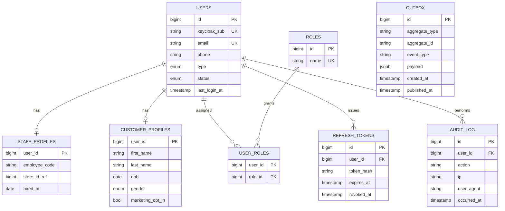

#### catalog_db
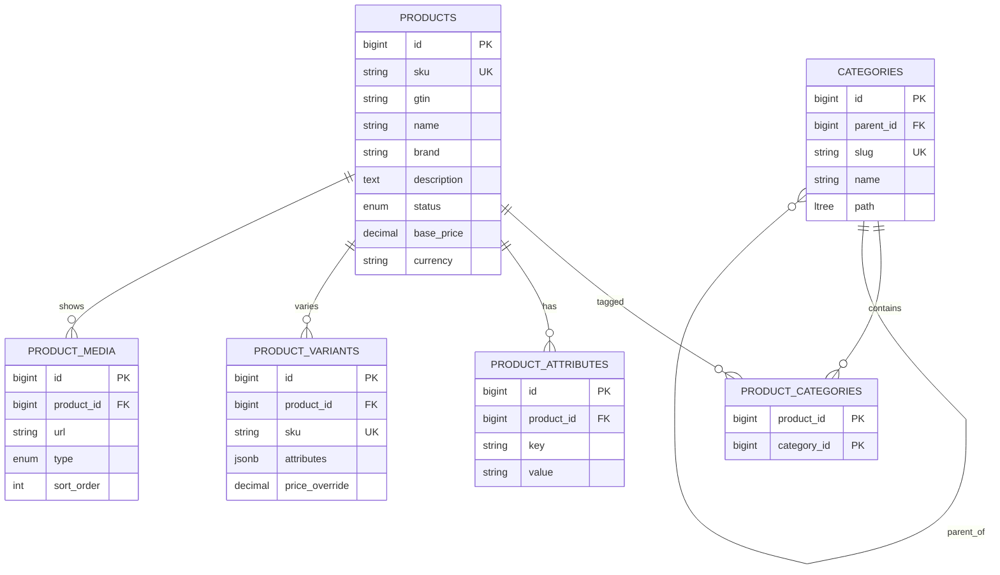

#### inventory_db
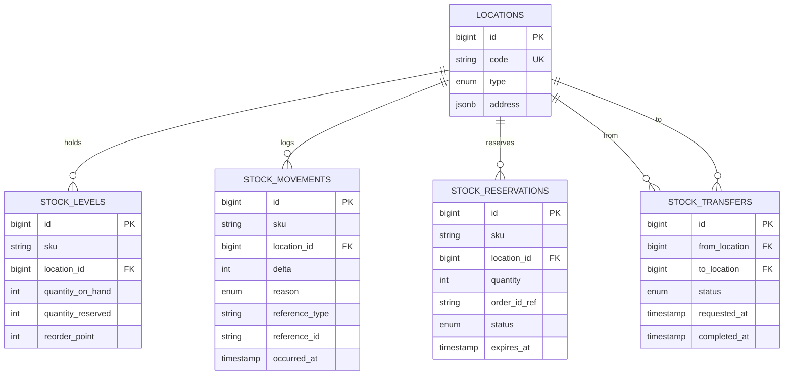

#### pricing_db
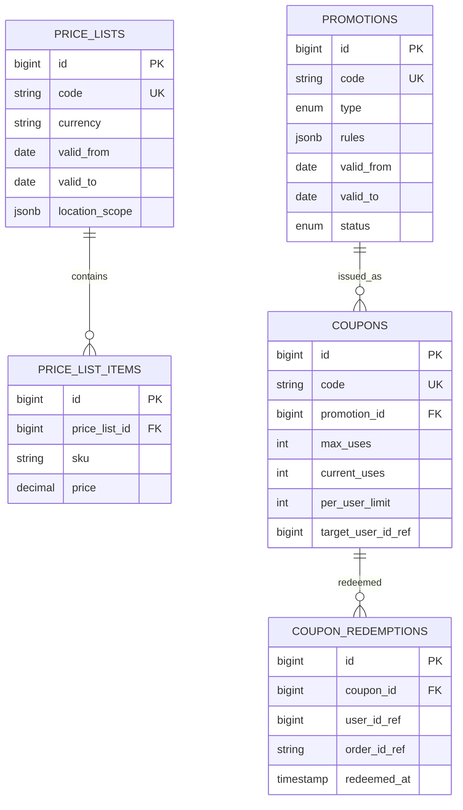

#### order_db
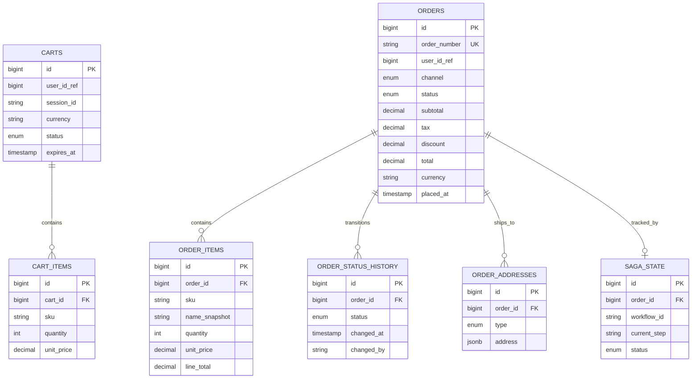

#### payment_db
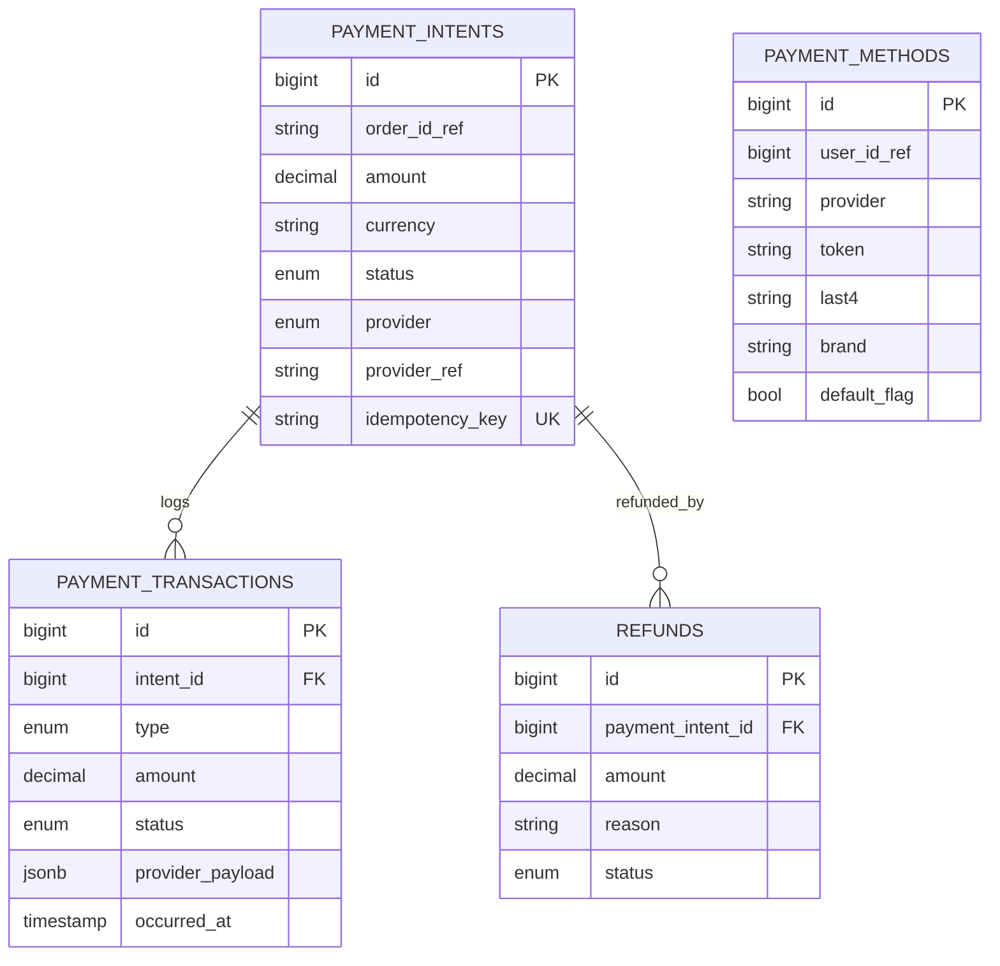

#### fulfillment_db
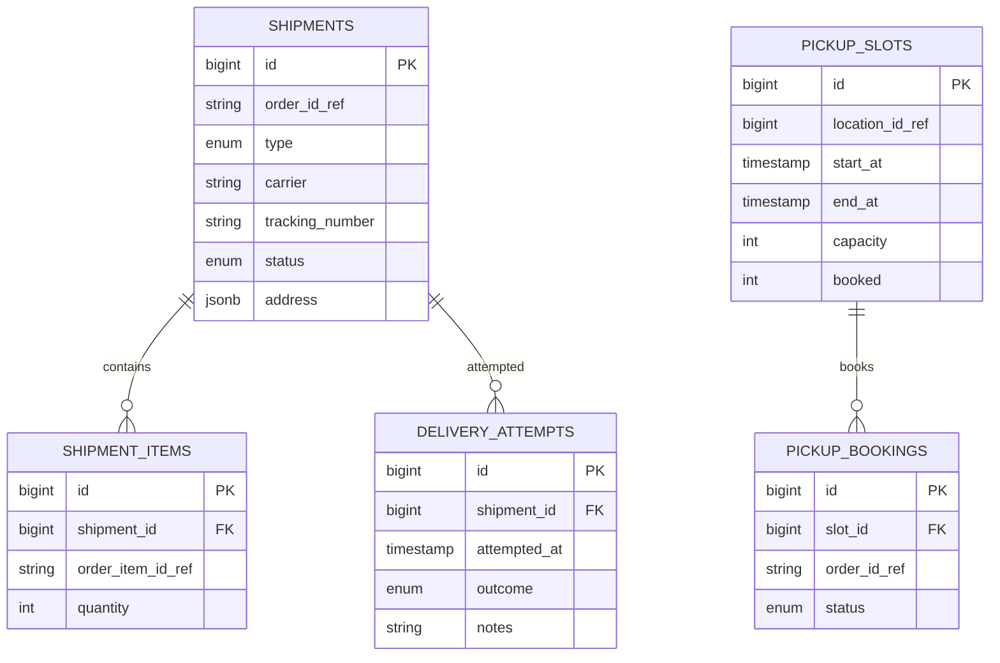

#### store_db
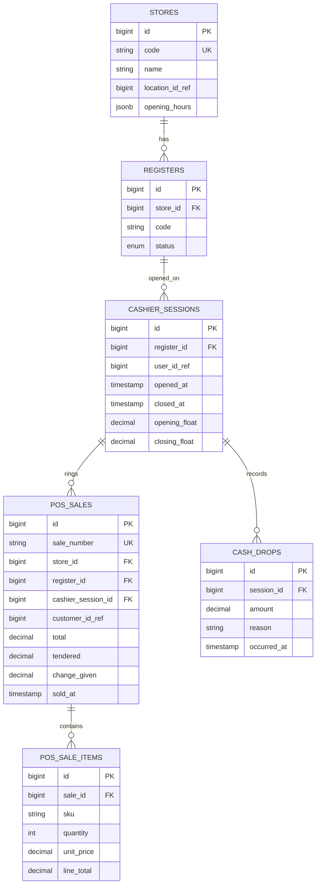

#### crm_db
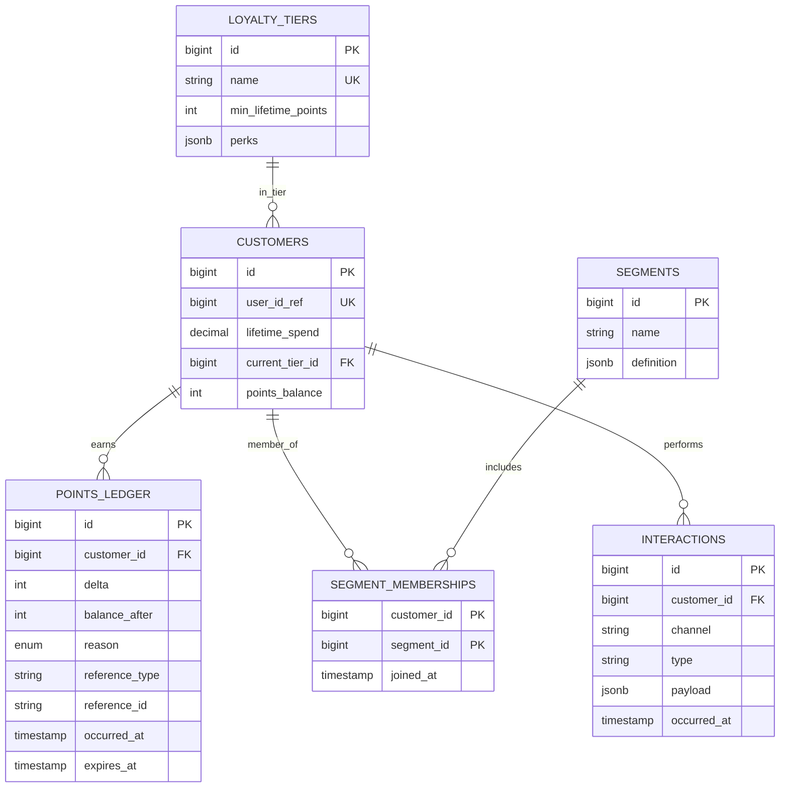

#### notification_db
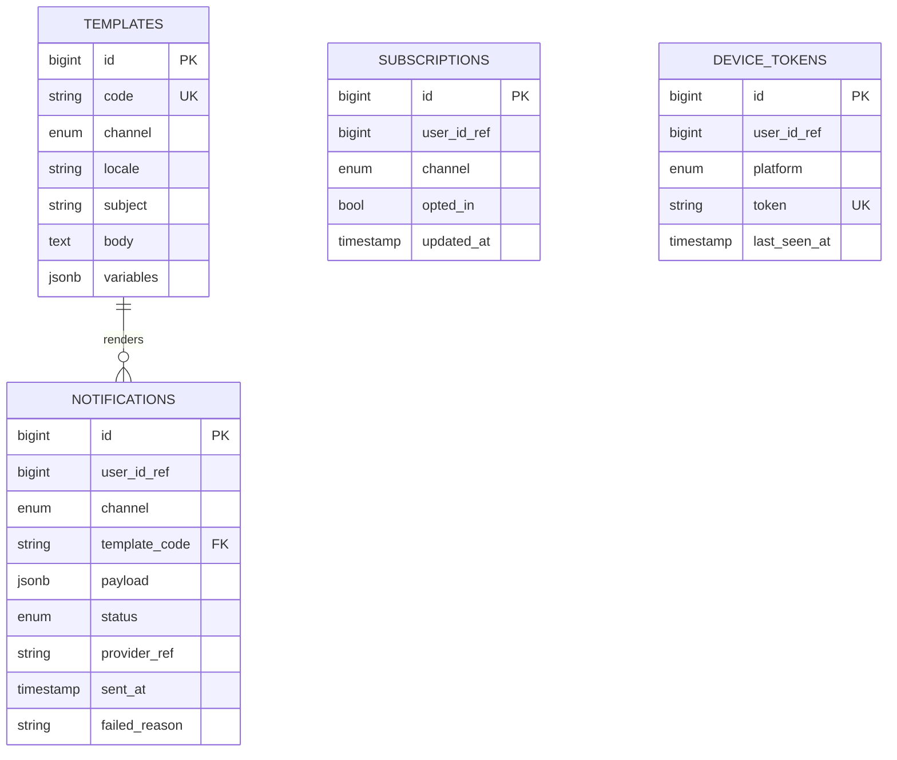

#### Cross-DB logical references (event-driven, no FKs)
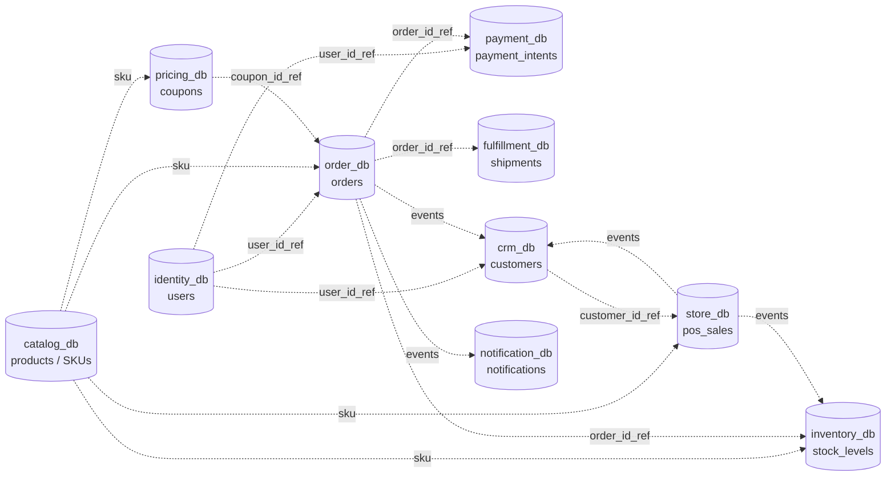

---

## 3. Frontend Applications

### 3.1 Public Shop (Next.js 14, App Router, SSR)
- Pages: home, category browse, PDP, cart, checkout, account, order tracking, loyalty dashboard.
- SSR for SEO pages; ISR for category/PDP; CSR for cart/account.
- Auth via NextAuth + Keycloak provider.

### 3.2 Staff CRM/POS Dashboard (Next.js 14, App Router, CSR)
- Pages: dashboard, customer 360, order ops, inventory, POS terminal, loyalty admin, campaigns, reports.
- Role-gated routes (Admin/StoreManager/Cashier).
- Real-time updates via SSE over HTTP (no WebSocket streaming required for MVP).

### 3.3 Mobile App (React Native + Expo)
- Tabs: Shop, Scan (barcode/QR for in-store loyalty), Wallet (coupons, points, tier), Orders, Profile.
- Push: Expo Push → Notification Service (FCM/APNs upstream).
- Shared OIDC auth flow (PKCE) with Keycloak.
- Offline cart cache (MMKV).

---

## 4. Key Workflows (Saga Orchestration via Temporal)

### 4.1 Online Order Saga (orchestrated)
Steps (Temporal workflow `PlaceOrderWorkflow`) — activities invoke target services via REST:
1. `CreateOrder` (Order Service) → status `PENDING`.
2. `ReserveStock` (Inventory Service) — per line item; compensate: `ReleaseStock`.
3. `AuthorizePayment` (Payment Service); compensate: `VoidPayment`.
4. `ApplyCouponRedemption` (Pricing); compensate: `RevertRedemption`.
5. `ConfirmOrder` (Order Service) → emit `OrderConfirmed`.
6. `CreateShipment` (Fulfillment); compensate: cancel shipment.
7. `CapturePayment` after fulfillment ack → emit `OrderCompleted`.
8. CRM consumes `OrderCompleted` → grant points, possibly emit `LoyaltyTierChanged`.
9. Notification consumes `OrderConfirmed` + `OrderCompleted` + `LoyaltyTierChanged`.

### 4.2 In-Store POS Sale (choreographed, simpler)
- POS Service emits `POSSaleCompleted` after register tender.
- Inventory consumes → decrement stock.
- CRM consumes → grant points if customer linked.
- Notification consumes → push receipt.

### 4.3 Omnichannel Inventory Sync
- Single source of truth: Inventory Service.
- All channels (online, POS, mobile) call `ReserveStock` synchronously over REST at checkout for fast feedback.
- Async events (`StockAdjusted`) republished to Search and to Catalog read-models.

### 4.4 Refund Saga (orchestrated)
- Trigger via CRM/admin; Temporal coordinates Payment refund → Order status update → Inventory restock → Loyalty point reversal → Notification (all REST activities).

---

## 5. Cross-Cutting Concerns

- **AuthZ**: JWT with `roles` claim; Quarkus `@RolesAllowed`. Customer endpoints check `sub` ownership.
- **Resilience**: SmallRye Fault Tolerance — `@CircuitBreaker`, `@Retry`, `@Bulkhead`, `@Timeout` on every outbound REST call. Default budgets: retry 3x exp backoff, CB 50% failure threshold.
- **REST conventions**: OpenAPI 3 first; versioned URIs (`/v1/...`); ProblemDetails (RFC 7807) error format; idempotency keys on POST that mutates money/stock.
- **Observability**: OTel SDK exporting to AWS OTel Collector → CloudWatch + Grafana/Tempo/Loki. Correlation IDs propagated via W3C TraceContext + Kafka headers + `traceparent` HTTP header.
- **Schema evolution**: Avro + Confluent Schema Registry for Kafka; OpenAPI semver for REST (BACKWARD compatible within major version).
- **Native image**: GraalVM `mvn package -Pnative`. Reflect-config managed via Quarkus build steps.
- **Secrets**: AWS Secrets Manager + External Secrets Operator on EKS.
- **Multi-tenancy**: `tenant_id` column on all tables; RLS policies as defense-in-depth.

---

## 6. AWS Deployment Topology

- **EKS** cluster (3 AZs), node groups: `general` (Graviton t4g.medium), `kafka-consumers` (m6g.large), `temporal` (m6g.large).
- **RDS Postgres 16**: one instance per service in dev; consolidated multi-DB instance with isolated DBs/users acceptable in non-prod. Prod: separate RDS per service tier with read replicas for read-heavy (Catalog, Inventory).
- **MSK** (3 brokers, kafka.m7g.large).
- **OpenSearch** managed cluster for Search.
- **ElastiCache Redis** for cart sessions, rate-limit counters, idempotency keys.
- **S3** for product media + invoices.
- **CloudFront** in front of Next.js public shop (Vercel-on-AWS pattern via OpenNext or self-host on ECS Fargate with CF).
- **Route53 + ACM + WAF** at edge.
- **CI/CD**: GitHub Actions → ECR → ArgoCD on EKS.

---

## 7. Repository / Module Layout

```
/services
  /identity-service        (Quarkus)
  /catalog-service
  /inventory-service
  /pricing-service
  /order-service
  /payment-service
  /fulfillment-service
  /store-pos-service
  /crm-loyalty-service
  /notification-service
  /search-indexer-service
/contracts
  /avro-schemas            (Kafka event schemas)
  /openapi                 (REST API contracts per service)
/platform
  /temporal-workflows      (shared Java)
  /shared-libs             (otel, security, outbox, rest-client)
/web
  /shop-next               (public SSR)
  /admin-next              (staff CRM/POS)
/mobile
  /retail-app              (Expo RN)
/infra
  /terraform               (AWS, EKS, RDS, MSK, OpenSearch)
  /helm                    (per-service charts)
  /argocd
```

---

## 8. Implementation Roadmap (Phased)

### Phase 0 — Foundations (Weeks 1–3)
1. Provision AWS baseline via Terraform (VPC, EKS, ECR, RDS dev, MSK, OpenSearch, Secrets Manager, Route53). *parallel*
2. Stand up Keycloak with realms `customers`, `staff` and seed roles. *parallel*
3. Bootstrap monorepo, shared libs (`otel-starter`, `outbox-relay`, `security-jwt`, `rest-client`), Avro + OpenAPI schema repo.
4. Set up CI (GitHub Actions templates: build, native-image, Trivy scan, OpenAPI lint, push to ECR).
5. Deploy ArgoCD + base Helm chart template.

### Phase 1 — Core Catalog & Identity (Weeks 4–7) *parallel within phase*
1. Identity & Auth Service (REST + Keycloak integration + outbox + audit).
2. Product & Catalog Service (CRUD, categories, media to S3, search-indexer integration).
3. Inventory Service (stock levels, movements, reservations, REST `POST /v1/inventory/reservations`).
4. Search Indexer Service (consume catalog + inventory events → OpenSearch).
5. Admin Next.js — auth, product CRUD, inventory views.

### Phase 2 — Commerce Loop (Weeks 8–12)
1. Pricing & Promotions Service.
2. Order & Checkout Service + Temporal workflows skeleton.
3. Payment Service (Stripe sandbox + abstract provider SPI).
4. Fulfillment Service (delivery + click-and-collect).
5. Temporal `PlaceOrderWorkflow` end-to-end with compensations.
6. Public Shop Next.js — browse, PDP, cart, checkout, order tracking.

### Phase 3 — Omnichannel & Loyalty (Weeks 13–16)
1. Store & POS Service + Admin POS terminal page.
2. CRM & Loyalty Service (points ledger, tiers, segments, nightly tier job).
3. Notification Service (SES + SNS SMS + FCM/APNs via Expo).
4. Refund Saga.
5. Loyalty dashboard in Shop frontend.

### Phase 4 — Mobile + Hardening (Weeks 17–20)
1. Expo RN app (shop, scan, wallet, orders, profile).
2. GraalVM native-image rollout per service (validate reflect-config, test perf).
3. Resilience hardening (chaos tests with Litmus/Chaos Mesh).
4. Observability dashboards + SLOs + alerting.
5. Load tests (k6) at projected medium scale: 500 stores, 1M customers, 200 RPS order peak.

### Phase 5 — Production Readiness (Weeks 21–24)
1. Security audit (OWASP ASVS L2), pen test, dependency scan.
2. DR runbooks, RDS PITR, MSK MirrorMaker cross-region.
3. Pilot rollout to 5 stores → 50 → full.
4. Documentation, on-call rotations, runbooks.

---

## 9. Critical Decisions Captured

- **Sync transport**: **REST only** (no gRPC). OpenAPI 3 contracts, JSON over HTTP/2. SmallRye Fault Tolerance on every outbound call.
- **Saga style**: Temporal orchestration. Workflows live in `platform/temporal-workflows`, workers co-located per service.
- **Deployment**: AWS EKS.
- **Scale target**: Medium (50–500 stores, 100k–1M customers).
- **Payment**: Stripe primary + abstract SPI for local Vietnamese provider (VNPay/Momo as future plug-in). Multi-currency-ready, default USD; storefront can switch per region.
- **Loyalty defaults**: $1 = 1pt, 24-month expiry, 4 tiers (Bronze/Silver/Gold/Platinum).
- **DB-per-service**: enforced; no cross-service FK or joins; data sharing via events + read-models.
- **Mobile**: React Native (Expo) — code reuse with web for state/auth via shared TypeScript types.

---

## 10. Excluded / Out of Scope

- **gRPC / Protobuf** transport (REST only).
- Vendor-specific ERP integrations (SAP, Oracle).
- Computer-vision / scan-and-go checkout.
- Cryptocurrency payments.
- Franchise partner self-service portal (future phase).
- Detailed marketing automation flows (covered at MVP by simple segment + template push only).

---

## 11. Verification

1. **Architecture review**: domain model + event catalog signed off by stakeholders.
2. **Contract tests**: Pact (REST) between each consumer/producer pair in CI; OpenAPI spec validated on every PR.
3. **Saga tests**: Temporal test framework — happy path + each compensation branch per workflow.
4. **Load test**: k6 scenario — 200 RPS sustained checkout for 30 min, p95 < 800 ms.
5. **Native image**: each service starts < 200 ms, RSS < 80 MB idle (target 30 MB stretch — measure and document if missed).
6. **Resilience**: chaos experiments — kill 1 broker, 1 RDS failover, 1 pod per service; verify no data loss (outbox replay).
7. **Security**: OWASP ZAP scan green, JWT/OIDC flows verified, secrets never in env vars (only mounted).

---

## 12. Open Items / Further Considerations

1. **Tenant model** — single chain or multi-tenant SaaS? Plan assumes `tenant_id` columns for future multi-tenancy but deploys as single-tenant. Confirm.
2. **POS hardware** — receipt printers, cash drawers, barcode scanners: confirm target hardware (Star Micronics, Epson) for driver layer in POS frontend.
3. **Region/locale** — confirm primary region (impacts SES sender, SMS provider, tax engine). Currently agnostic.
4. **Tax** — pluggable tax engine (Avalara vs simple table)? Plan currently assumes simple per-jurisdiction table in Pricing Service.
